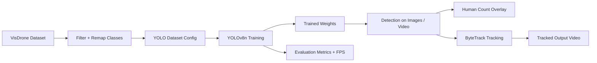

# Drone Human Detection and Tracking with YOLOv8

A computer vision pipeline for detecting and counting humans and cars in drone imagery using `YOLOv8n`, the `VisDrone` dataset, and ByteTrack-based tracking. This repo is useful in the portfolio because it includes concrete metrics, visible limitations, and an end-to-end experiment flow from dataset prep to tracked video output.

**Status:** Experimental CV pipeline  
**Stack:** Python, Jupyter Notebook, Ultralytics YOLOv8, OpenCV, ByteTrack  
**Focus:** Detection experiments, aerial vision, model evaluation

## Why this project

Aerial detection is difficult because targets are small, dense, and often occluded. This project explores that problem with a compact detection model and makes the tradeoffs visible through measured performance instead of only polished output visuals.

## Core capabilities

- Perform dataset EDA and class distribution analysis.
- Remap VisDrone labels into a simplified `human` and `car` task.
- Train a `YOLOv8n` detector on the filtered dataset.
- Render per-image counts and tracked output videos.
- Report detection quality and inference speed.

## Architecture list

1. Data preparation layer
   a. VisDrone download and filtering  
   b. Class remapping to `human(0)` and `car(1)`
2. Training layer
   a. YOLO dataset configuration  
   b. Model training and validation on aerial imagery
3. Inference layer
   a. Bounding-box prediction on images and video  
   b. Human-count overlays and display outputs
4. Tracking and evaluation layer
   a. ByteTrack-based identity tracking  
   b. Metrics, FPS benchmarking, and demo outputs

## Implementation diagram



## Results

| Metric | Value |
|---|---:|
| Overall mAP50 | 0.557 |
| Human mAP50 | 0.390 |
| Car mAP50 | 0.723 |
| Human Recall | 0.347 |
| Car Recall | 0.690 |
| Inference FPS | ~35 |

## Project structure

```text
Yolo_Detection_Starter/
├── ANTS_Second_Evaluation_for_Drone_YOLO (1).ipynb
├── class_distribution.png
├── dataset_eda_summary.txt
├── sample_*.png
├── tracked_output.mp4
├── tracked_humans_only.mp4
└── val_video.mp4
```

## Run locally

```bash
pip install ultralytics kaggle opencv-python groq
```

Then open the notebook and run the cells in order.

## Lessons from the results

- Human detection remains much weaker than car detection because aerial humans are small and often partially occluded.
- The model is fast enough for lightweight experimentation, but not accurate enough for safety-critical deployment.
- The pipeline is more valuable as a learning and evaluation build than as a finished production detector.

## Limitations

- Human mAP50 is only `0.390`
- Recall is low enough that many humans are missed
- Objects below roughly 30 pixels are difficult to detect
- Crowded scenes and occlusion remain failure cases

## Next improvements

- Try a larger YOLO variant
- Add small-object-focused augmentation
- Evaluate better tracking metrics
- Extend the notebook into a proper reproducible training package
